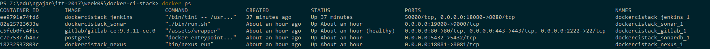
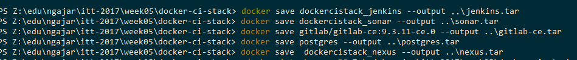

#Virtual Enviroment Untuk IMPAL Telkom University - 2017 -iml

##Cara Install
untuk menjalankan ini akan dibutuhkan docker.
Untuk yang menggunakan linux ubuntu dll bisa download di https://www.docker.com/community-edition dan ikuti cara installnya.

untuk yang windows ada dua pilihan,
jika punya windows versi 10 edisi profesional dan entreprise bisa download di https://store.docker.com/editions/community/docker-ce-desktop-windows tapi ingat sebelum install requirementnya (hyper-v) harus dipenuhi caranya lihat https://docs.docker.com/docker-for-windows/troubleshoot/#hyper-v 

kalau windowsnya versi 10 home ed, atau versi dibawahnya, bisa gunakan https://www.docker.com/products/docker-toolbox

setelah terinstal coba cek instalasi dan experiment mengikuti https://docs.docker.com/docker-for-windows/
https://docs.docker.com/docker-for-mac/
linux menyesuaikan dengan mac.

setelah itu clone repo ini

didalam repo ini ada 3 langkah yang harus dilakukan sebelum menjalankan docker.

1. membuat directory untuk docker bin
```setup-docker-bin.cmd```
ini hanya untuk windows dan mac, untuk linux mungkin tidak dibutuhkan, jika dibutuhkan sesuaikan script diatas.
2. membuat volume (virtual drive-nya docker)
```setup-docker-volumes.cmd```
untuk linux sama aja perintahnya tinggal ganti filenya *.sh
3. menjalankan image dengan memanggil docker-compose
```docker-compose up ```

butuh download sekitar 2-3GB, 
image bisa di download bareng2 (share) terus diinstall offline pakai perintah (contoh)
```docker load < busybox.tar.gz```
untuk mendapatkan image bisa jalankan ```docker-compose up``` di komputer yang tersambung ke internet kecepatan tinggi.
setelah berjalan semua.
image yang berhasil dibuat bisa dilihat dengan perintah sbb:

terus image2 tersebut bisa di ubah(export/save) jadi tar dengan perintah sbb


untuk mematikan tinggal ```ctl-c```

untuk menghapus instance docker ```docker-compose rm```
selamat mencoba

## Mengakses tools

#### With docker machine (virtual box etc)

| *Tool* | *Link* | *Credentials* |
| ------------- | ------------- | ------------- |
| Jenkins | http://${docker-machine ip default}:18080/ | no login required |
| SonarQube | http://${docker-machine ip default}:19000/ | admin/admin |
| Nexus | http://${docker-machine ip default}:18081/nexus | admin/admin123 |
| GitLab | http://${docker-machine ip default}/ | root/5iveL!fe |

#### With Docker Native (mac/hyver-p)

| *Tool* | *Link* | *Credentials* |
| ------------- | ------------- | ------------- |
| Jenkins | http://localhost:18080/ | no login required |
| SonarQube | http://localhost:19000/ | admin/admin |
| Nexus | http://localhost:18081/nexus | admin/admin123 |
| GitLab | http://localhost | root/5iveL!fe |